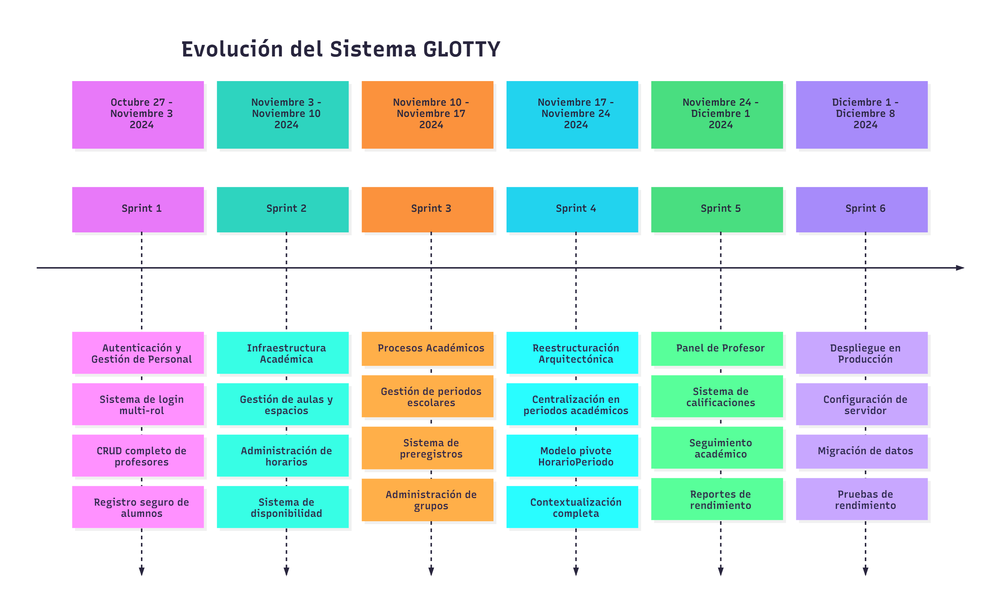

# Evolución de Desarrollo - Sistema GLOTTY

**Historial de Versiones**

| Versión | Fecha | Autor | Descripción de los Cambios |
|---------|-------|-------|---------------------------|
| 1.0 | 15/01/2025 | Isaac Jonathan Santos Rojas | Documentación inicial de la evolución del proyecto |
| 1.1 | 20/01/2025 | Isaac Jonathan Santos Rojas | Agregado timeline completo y análisis de impacto |
|         |       |                       |                           |

## Resumen Ejecutivo

El proyecto GLOTTY ha evolucionado desde una base fundamental de cubrir una necesidad hacia una platadorma académica generada con el fin de dar solución a la problematica de mejorar la gestion y acceso a la información de el departamento de lenguas extranjeras.

## Cronología de Desarrollo

## **Resumen de la Evolución**
### Fase 1: Fundamentos del Sistema (Sprints 1-2)
El proyecto inició con la implementación de los componentes esenciales de seguridad y gestión. Durante los primeros dos sprints, se establecieron las bases técnicas que permitirían el desarrollo posterior de funcionalidades académicas complejas. El sistema de autenticación multi-rol y la gestión de infraestructura sentaron las bases para una plataforma escalable y segura.

## Fase 2: Procesos Académicos (Sprint 3)
Con los fundamentos establecidos, el equipo desarrolló los procesos académicos centrales del sistema. Esta fase introdujo la gestión de periodos escolares, el sistema de preregistros de estudiantes y la administración de grupos académicos. Durante la revisión de este sprint, se identificó la necesidad de una reestructuración arquitectónica para optimizar la organización del sistema.

## Fase 3: Transformación Arquitectónica (Sprint 4)
El cuarto sprint representó un punto de inflexión en la arquitectura del sistema. Se realizó una reingeniería completa para establecer el periodo académico como entidad raíz de todas las operaciones. Esta transformación introdujo el modelo pivote HorarioPeriodo, que permitió la reutilización contextual de horarios entre diferentes periodos académicos mientras se mantenían instantáneas específicas.

## Fase 4: Expansión y Producción (Sprints 5-6)
La fase actual del proyecto se enfoca en expandir las capacidades del sistema mediante el desarrollo del panel de profesor y preparar la plataforma para su despliegue en ambiente de producción. Estos sprints completarán el ciclo de desarrollo inicial y posicionarán al sistema para operaciones institucionales a gran escala.
