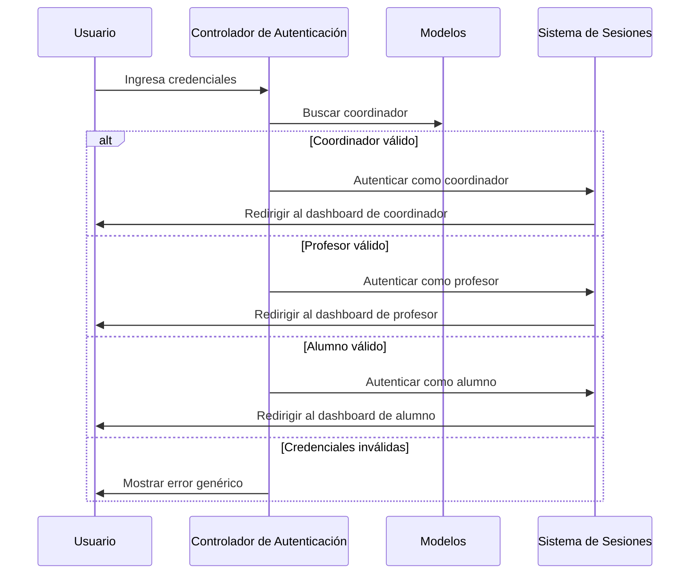

# Sprint 1: Implementación de Autenticación y Gestión de Personal

**Fecha:** 24 Octubre - 5 Noviembre 2024  
**Estado:** Completado  
**Equipo:** Axolotl Solutions

## Objetivo
Establecer los fundamentos de seguridad del sistema y la administración de recursos humanos académicos.

## Actividades Desarrolladas
Se implementó el sistema de autenticación y autorización, junto con la gestión inicial de los perfiles académicos.

## Arquitectura del Sprint 1
El sistema de autenticación de GLOTTY implementa un sistema unificado multi-rol que permite el acceso seguro a tres tipos de usuarios mediante un único punto de entrada. Utiliza el sistema de Guards de Laravel para mantener sesiones separadas y seguras.

### Controladores Desarrollados
- **`AuthController.php`** - Gestión centralizada de autenticación para todos los tipos de usuario
- **`ProfesorController.php`** - Operaciones CRUD para la administración del cuerpo docente

### Modelos Implementados
- **`Usuario.php`** - Modelo base para la gestión de alumnos internos y externos
- **`Profesor.php`** - Modelo para la gestión de información del personal docente
- **`Coordinador.php`** - Modelo para la administración de usuarios coordinadores

## Sistema de Autenticación Unificado

### Características Principales
- **Login multi-rol** para 3 tipos de usuario: Alumnos, Profesores y Coordinadores
- **Sistema de Guards** de Laravel para separación de sesiones
- **Registro seguro** de alumnos con validaciones completas
- **Redirección inteligente** a dashboards específicos

### Flujo de Autenticación

